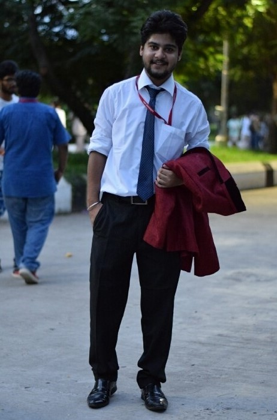
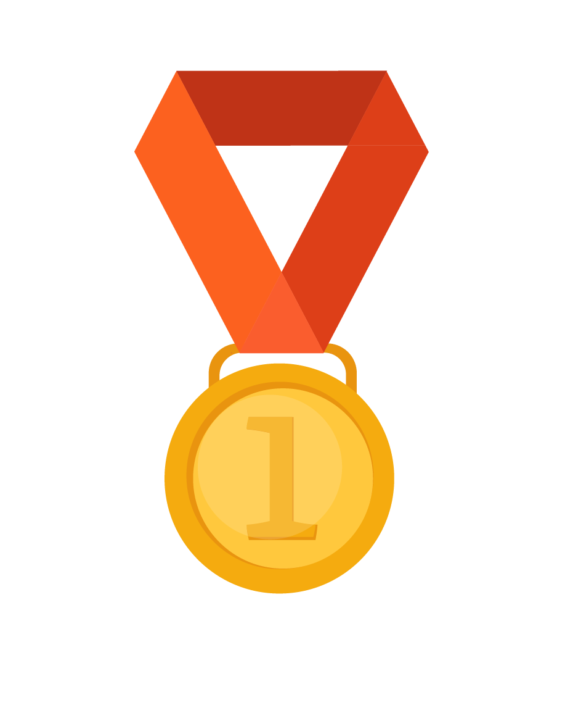

<link rel="stylesheet" type="text/css" href="https://stackpath.bootstrapcdn.com/bootstrap/4.3.1/css/bootstrap.min.css">

<body>
	<header>
	

	My Profile	
	

	</header>
	

	 
	

	

	Kushank Mahajan 
	B.Tech(Information Technology)
	

	

		
My Project Work

		
My Internships

	

	

	

		

			 
			DC MOTOR AND ITS APPLICATIONS 
			(DEPARTMENT OF PHYSICS AND NANOTECHNOLOGY)
			
Oct 2016 - Oct 2016

		

		

			 
			WEB DEVELOPER 
	(Level Infinite Technologies,Kattankulathur,TN)

Jun 2018 - Jun 2018

		

	

	

		POSITION OF RESPONSIBILITY
	

	

		Committe head(AARUUSH-A NATIONAL LEVEL TECHNOMANAGEMENT FEST)
		
Jul 2017 - Jul 2018

	

	

		Corporate Committe Member(TEAM NAVAN)
		
Jul 2017 - Apr 2018

		
	

	

		Sponsorship Committe Member 
(Directorate of student affairs)
		
		
Jul 2017 - Mar 2018

	

	

		ORGANISER(RM HACKATHON BY IT ASSOCIATION)
		
		
Oct 2017 - Oct 2017

	

	

		Sponsorship Committe Head(Directorate of student affairs)
		
Jun 2018 - Present

	

	

		Awards and Recognition
	

	

		
	

	

				

				
				Extempore for Personality Development 
				(FIRST POSITION)
				
Oct 2016

			

			

				TECHKNOW-2016
				 
		(First Position)
	
Sep 2016

			

							

				VOLUNTEER
				 
				(INITIATING FUSION - NGO)
				
Jul 2016 - Jul 2017

			

	

	<footer>
	

	<u>Contact Us</u>
	 
	Kushankmahajan_dinesh@srmuniv.edu.in 
	9463743900	
	

	</footer>

	
</body>
